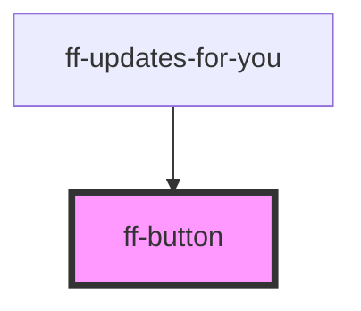

# ff-button

<!-- Auto Generated Below -->

## Properties

| Property | Attribute | Description | Type                                                                                                                                                                    | Default     |
| -------- | --------- | ----------- | ----------------------------------------------------------------------------------------------------------------------------------------------------------------------- | ----------- |
| `size`   | `size`    |             | `"big" \| "huge" \| "large" \| "massive" \| "medium" \| "mini" \| "small" \| "tiny"`                                                                                    | `'medium'`  |
| `type`   | `type`    |             | `"black" \| "blue" \| "brown" \| "green" \| "grey" \| "olive" \| "orange" \| "pink" \| "primary" \| "purple" \| "red" \| "secondary" \| "teal" \| "violet" \| "yellow"` | `'primary'` |

## Dependencies

### Used by

 - [ff-updates-for-you](../ff-updates-for-you)

### Graph

----------------------------------------------

*Built with [StencilJS](https://stenciljs.com/)*
