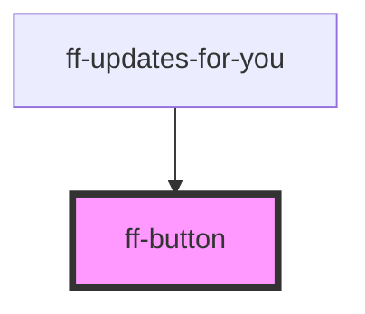

# ff-button

<!-- Auto Generated Below -->

## Properties

| Property | Attribute | Description | Type  | Default     |
| -------- | --------- | ----------- | ----- | ----------- |
| `size`   | `size`    |             | `any` | `'medium'`  |
| `type`   | `type`    |             | `any` | `'primary'` |

## Dependencies

### Used by

 - [ff-updates-for-you](../ff-updates-for-you)

### Graph

----------------------------------------------

*Built with [StencilJS](https://stenciljs.com/)*
