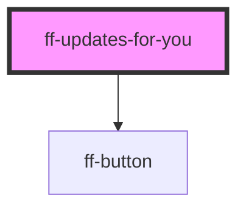

# ff-updates-for-you

<!-- Auto Generated Below -->

## Properties

| Property     | Attribute | Description | Type          | Default     |
| ------------ | --------- | ----------- | ------------- | ----------- |
| `benchmarks` | --        |             | `Benchmark[]` | `[]`        |
| `locale`     | `locale`  |             | `string`      | `undefined` |

## Events

| Event            | Description | Type               |
| ---------------- | ----------- | ------------------ |
| `detailBtnClick` |             | `CustomEvent<any>` |

## Dependencies

### Depends on

- [ff-button](../ff-button)

### Graph

----------------------------------------------

*Built with [StencilJS](https://stenciljs.com/)*
